## References

- The New Public Health (Third Edition), [Chapter 3 - Measuring, Monitoring, and Evaluating the Health of a Population](5.DemographicTransition/demography.pdf) Authors: Theodore H.Tulchinsky MD, MPH and Elena A.Varavikova MD, MPH, PhD DOI: https://doi.org/10.1016/C2010-0-68514-2


- K.S. James: Glorifying Malthus (2008), Current Debate on Demographic Dividend in India, Economic and Political Weekly, June 21, available at http://citeseerx.ist.psu.edu/viewdoc/download?doi=10.1.1.546.5465&rep=rep1&type=pdf

- Economic Survey 2018-19 Volume 1 Chapter 7 [India's Demography at 2040](5.DemographicTransition/esch7.pdf)

## Demography
- Demography is *“the study of populations, especially with reference to size and density, fertility, mortality, growth, age distribution, migration, and vital statistics and the interaction of all these with social and economic conditions”*
- **Vital statistics** include births; deaths; and population by age, gender, location of residence, marital status, socioeconomic status (SES), and migration. 
- Birth data are derived from mandatory reporting of births and mortality data from compulsory death certificates.

## Demographic transition
- **Demographic transition** is a long-term trend of declining birth and death rates, resulting in substantive change in the age distribution of a population. 
- Population age and gender distribution is mainly affected by birth and death rates, as well as other factors such as migration, economics, war, political and social change, famine, or natural disasters. 
- Economic development has a profound effect on population patterns, and demographic transition may be characterized by the following stages:
  - *Traditional* – high and balanced birth and death rates.
  - *Transitional* – falling death rates and sustained birth rates.
  - *Low stationary* – low and balanced birth and death rates.
  - *Graying of the population* – increased proportion of elderly people as a result of decreasing birth and death rates, and increasing life expectancy.
  - *Regression* – low birth rates, migration, or increasing death rates among young adults due to trauma, acquired immunodeficiency syndrome (AIDS), early cardiovascular disease (CVD) mortality, or war can result in a steady or declining population (i.e., demographic regression).
  
---

- Birth rates in the industrialized countries have fallen over the past half-century and are continuing to fall in many countries to levels below rates needed to sustain or maintain population size and age distribution. 
- This contributes to aging of the population, with important economic and societal effects. 
- Economic prosperity, efficient and easily available methods of birth control, and greater education and work opportunities for women in the workforce are major factors in choices made in terms of the number of children a
woman wishes to have, and her right to determine the number and spacing of pregnancies. 
- Access to prenatal diagnosis of the gender of the fetus has resulted in wide-scale abortion of females because of birth policies, with parental preference for male children in China and India as examples. 
- This is resulting in a major numerical deficiency of young women in the population with many attendant social and political effects. 
- Reduced fertility and mortality, as in Japan and many countries in Western Europe, also have many societal and economic consequences, as a smaller workforce has to maintain a higher elderly population dependent on social security benefits.


## Fertility
- Fertility is influenced by cultural, social, economic, religious, and even political factors. 
- Although economic prosperity may initially promote higher birth rates, increases in education levels and economic prospects, as well as in survival of those born, are generally related to reduced birth rates and natural population growth.
- **Commonly Used Fertility Rates**
  - *Crude birth rate (CBR)* – the number of live births in a population over a given period, usually one calendar year, divided by the midyear population of the same jurisdiction, multiplied by 1000.
  - *Total fertility rate (TFR)* – the average number of children that a woman would bear if all women lived to the end of their childbearing years and bore children according to age-specific fertility rates; most accurately answering the question *“how many children does a woman have, on average?"*
  
## Population Pyramid
- A population pyramid provides a graphic display of the percentage of men and women in each age group in a total
population. 
- A wide population base and a high birth rate in a country or region result in a large percentage of its population being under 15 years of age; accompanied by limited economic resources, this is a formula for continued poverty. 
- A population pyramid with a narrow base (i.e., few young people) and a growing elderly population will have a smaller workforce to provide the economic base for the “dependent age” population (i.e., both the young and the old). 
- With aging of the population in many countries due to low birth rates and increasing longevity, the concept of dependent population groups of those under the age of 15 and those over 65 as a percentage of the total population is increasingly relevant to social and economic planning.

---

- 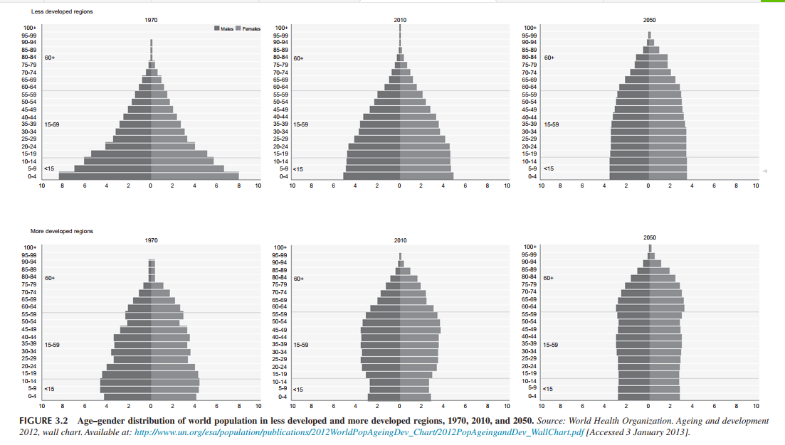{width=800px}

---


- [Population Pyramid for India](https://www.populationpyramid.net/india/)

<iframe width="560" height="315" src="https://www.populationpyramid.net/india/" title="Population Pyramid for India" frameborder="0" allow="accelerometer; autoplay; clipboard-write; encrypted-media; gyroscope; picture-in-picture" allowfullscreen></iframe>


# Demorgaphic dividend in India

---

- Demographic dividend: *The phase of the demographic transition where the proportion of the working age population will be one of the highest.*
- Expected to be a shorter phase.
- Low dependency rate.

<blockquote>
The young and the old tend to consume more output than they generate, unlike working age individuals, who contribute to the output and savings tend to be more commensurate with their consumption -  [Bloom, Canning, and Malanay 2000].
</blockquote>

- Outcomes depend on the ability of the countries to take advantage of this phase.
- Decline in fertility $\rightarrow$ benefits at the household levels.


## Demographic Rationale for Economic Change

- Age structure transition leads to growth in several ways:
  - Increased Savings
  - Decline in fertility
  - More investment in health
  - Government expenditure diverted to productive ones.


---

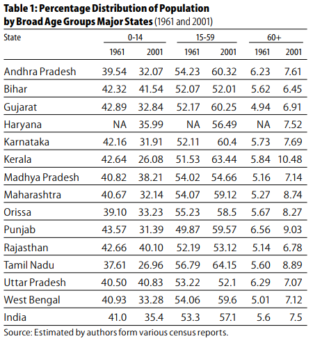

---

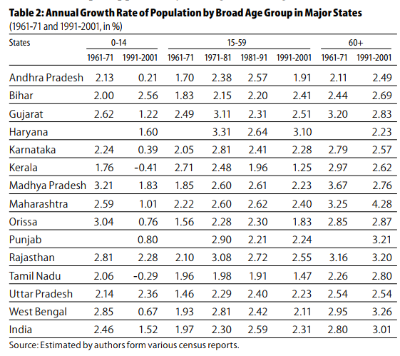

---

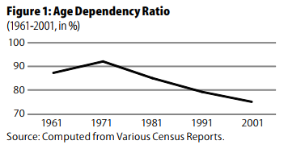


---

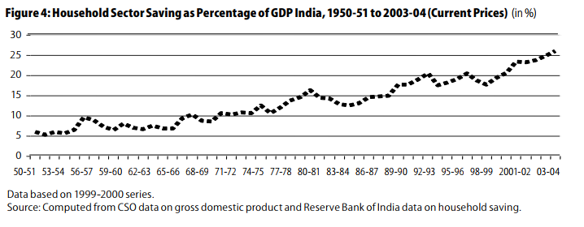


---


```{r, echo=FALSE, message=FALSE, warning=FALSE}
library(tidyverse)
tribble(
  ~State, ~`1981`, ~`1991`, ~ `2001`,
'Andhra Pradesh', 52.21, 52.56, 51.89,
'Bihar', 22.64, 25.42, 35.04,
'Gujarat', 33.23, 41.33, 42.56,
'Haryana' ,17.78, 18.56, 43.60,
'Karnataka', 40.66, 46.19, 47.80,
'Kerala' ,26.63, 24.04, 22.45,
'Madhya Pradesh', 48.87 ,52.61, 46.93,
'Maharashtra' ,49.89, 53.69, 56.93,
'Orissa' ,31.73 ,32.80, 37.70,
'Punjab', 9.77, 7.01, 28.66,
'Rajasthan', 35.57, 46.05, 54.99,
'Tamil Nadu' ,39.78, 43.99 ,44.26,
'Uttar Pradesh' ,13.39, 20.76, 28.28,
'West Bengal' ,13.38, 18.18, 28.13,
'India', 31.85, 35.86, 40.02
) %>% 
  pivot_longer(cols = `1981`:`2001`, names_to = "Year", values_to = "FLFP") %>% 
  ggplot() +
  geom_bar(aes(x = Year, y= FLFP), stat="identity")+
  facet_wrap(~State)+
  labs(title = "Female labour Force participation\nin Major States (15-59 age group,\n1981-2001, in %)")
```


---

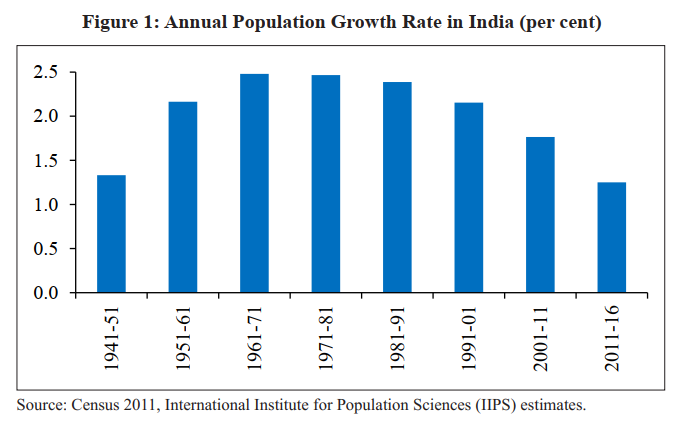

---

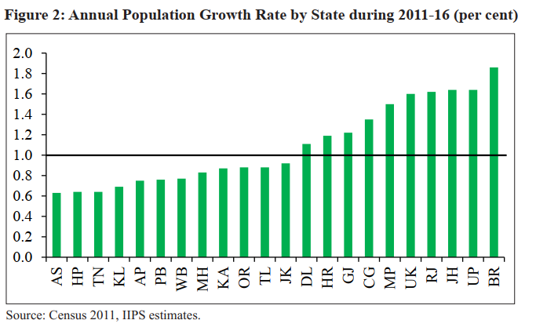

---

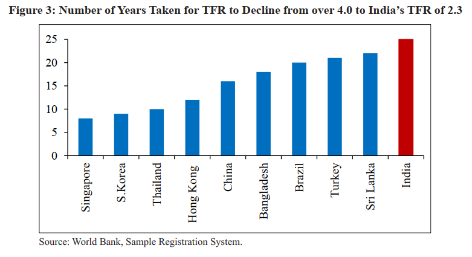


---

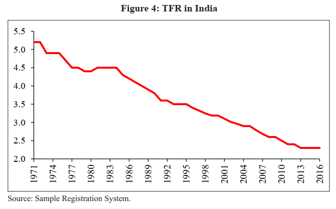


---

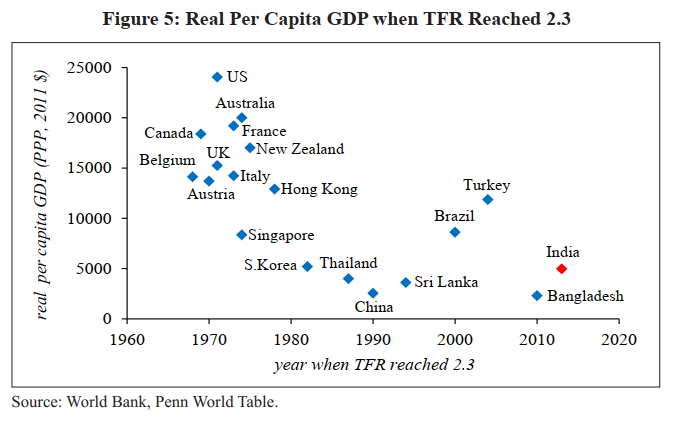

---

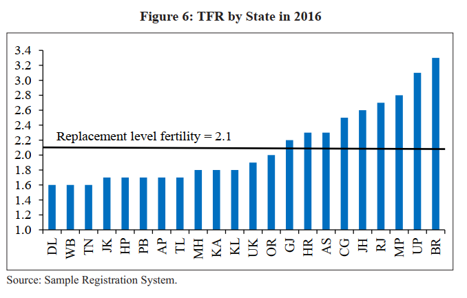

---


---

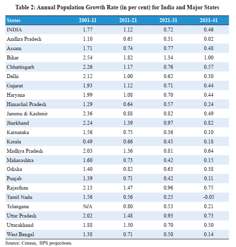

---

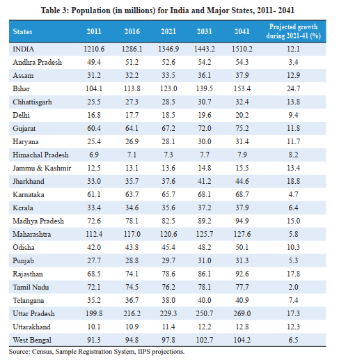

---

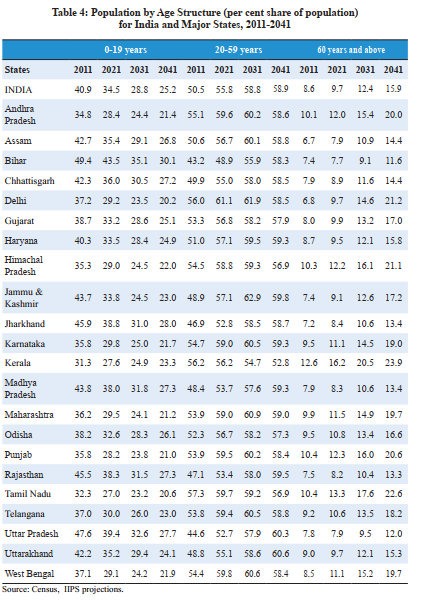

---

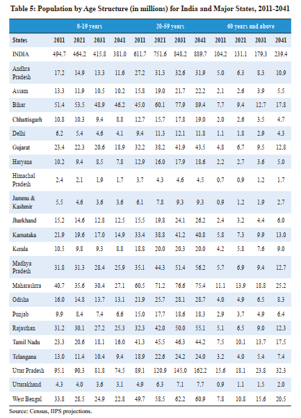

---

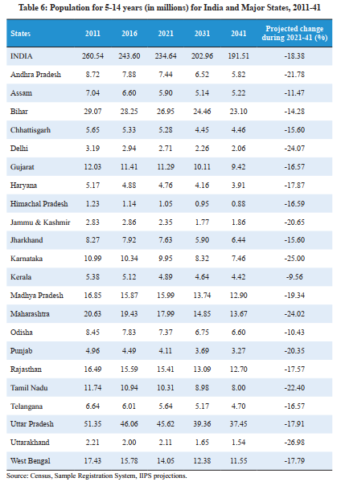

---

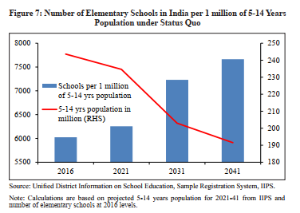

---

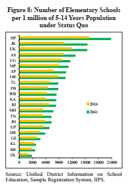{width=700px}

---

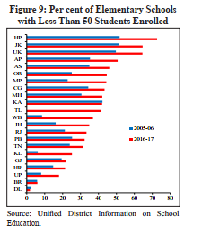{width=300px}

---

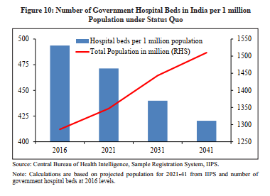{width=700px}

---

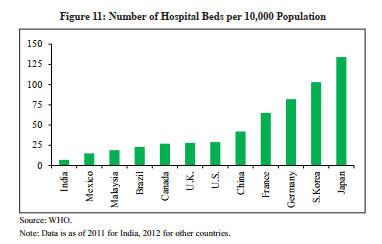{width=700px}

---

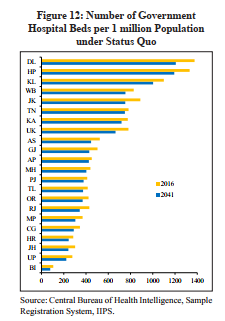{width=300px}

---

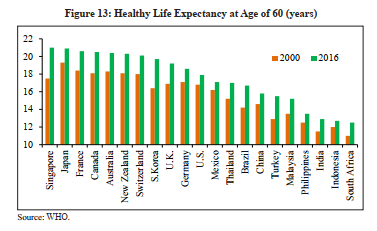{width=700px}

---

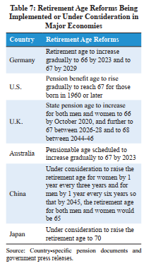{width=300px}

---

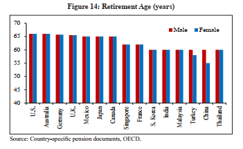{width=700px}

