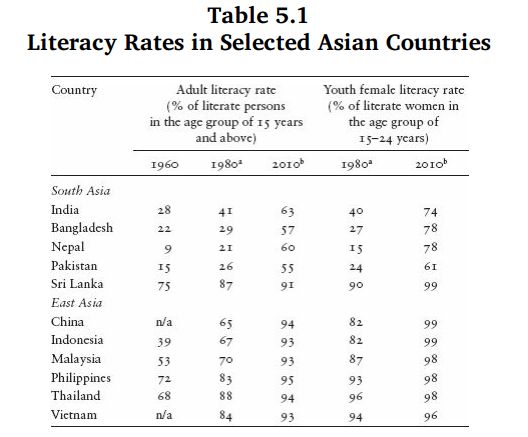
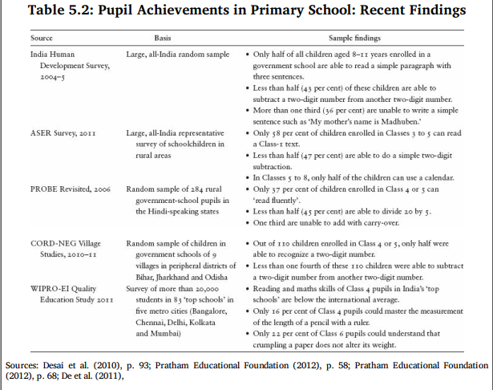
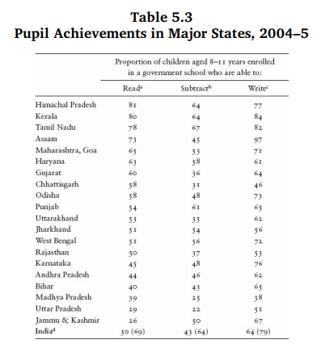
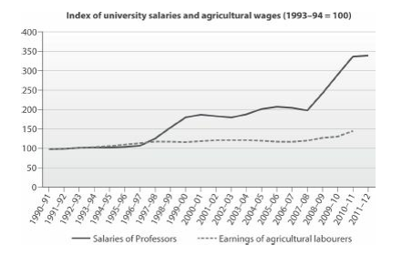
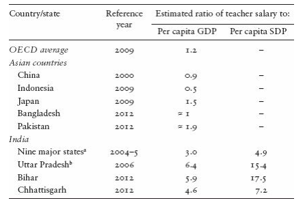

## References
- Chapter 5: [The Centrality of Education](6.Education/sen.pdf), in An Uncertain Glory: India and its Contradictions, by Jean Dreze and Amartya Sen, 2013.

# The Centrality of Education

## The role of education
- Freedom to understand the world
- Gaining economic opportunities
- Relief from insecurities
- Tackling health problems
- Build public perceptions and human rights
- Understand and use of legal rights
- Women empowerment
- Reduce inequalties based on caste and class.

## Development and education
- Emphasis on the role of state resources for public education by [Adam Smith](https://en.wikipedia.org/wiki/Adam_Smith).
<blockquote>
For a very small expense the public can facilitate, can encourge, and can even impose upon almost the whole body of the people, the necessity of acquiring those most essential parts of education.
</blockquote>
- Europe and America have such government initiatives.
- Lessons from Japan too
  - [Meiji Era](http://afe.easia.columbia.edu/special/japan_1750_meiji.htm) (1868-1912)
  - Investment in Education between 1906 to 1911 was 43% of GDP.
  - Rapid progress of elementary education
  - By 1910, Japan was nearly fully literate, publishing more books than Britain and America.
  - Later South Korea, China, Singapore, Hong Kong and Taiwan followed suite.
  
## India left behind
- Expansion of school education remarkably slow in India

---

- Progress even slow for women and younger women.
- About 20% of children aged 6-14 not attending school in 2005-06.
- Exception of Kerala
  - Formed after independence (Travancore and Cochin)
  - Own domestic policies under British Raj
  - A history of pro education policies
  - Continued and intensified these policies after independence.

## Challanges of Higher Education
- Higher education as a western contribution to the world.
  - The oldest university: [Bolonga](https://www.unibo.it/en) in Italy founded in 1088, University of Paris (1091), Oxford University (1167), Cambridge University (1209)
- In India
  - Nalanda university (600 yrs older than Bolonga)
  - Pan-Asian university
  - Religion, law, history, linguistics, medicine, pubilc health, architecture, and sculpture.
  - [Documents in Nalanda were burnt down by Bhaktiyar Khilji at the end of the 12th century](https://en.wikipedia.org/wiki/Nalanda).
- The achievements of the contemporary Indian universities have been limited.
- Very less or no universities in the top 200 list by the Times Higher Educational Supplement
- None from Asia in top 20.

## Achievements and deficiencies
- Steady increase in school enrollment for boys and girls
  - The Sarva Shiksha Abhiyan 
  - The Right to Education Act 2010
    - Free and compulsory education for 4-16 years of children
    - Education as a fundamental right for children
- The Public Report on Basic Education (PROBE)
  - Shortage of appointed teachers
  - Absenteeism and breakdown of regularity maintained in schools
  - Effective teaching days = 100 per year
  - 50% of the effective teaching days without teaching activity.
  
## Educational standards
- Two principal deficiencies
  1. Limitation of coverage
  2. Poor standard of education
- PROBE (2006)
  - 50% of pupils in classes 4 & 5 could not do single digit multiplication or a simple division by 5. **See Table 5.2**
- Programme for International Student Assessment (PISA) 2009
  - India at bottom 74 of the countries included in the survey.

Note: PISA is a worldwide study conducted by Organisation for Economic Cooperation and Development (OECD). In the PISA test the students are assessed in reading, maths, and science, and try to understand 'what they can do with what they know'.
  
---

{width=700px}

---

- [IHDS](https://ihds.umd.edu/about), [ASER](https://www.asercentre.org/)

---

- PISA  and other tests are culture related and reflect western biases?
- Research based worrying aspects of public achievements in India
  1. Very slow improvement
  2. The outcomes are not too different between private and government schools.

## Privileged excellence and social divisions
- The IITs and the IIMs offer teaching and guidance of the highest quality.
- Indian firms also handle outsourced business from Europe and America.
- Indian education system is extraordinarily diverse:
  - A tiny group of privileged class enjoying high and outstanding education opportunities
  - A bulk of the population confined to poor and deficient education system.

## School management and the teaching profession
- State sponsored education has helped the spread if literacy across the world.
- In India we see much reliance on private schools.
- The classic problem of school education in India has been that of underfunding by the state.
- The issue of salaries of teachers has been resolved to some extent.
- Average salary of a school teacher is 10 times more than that of an agricultural labourer.
  - The wage differential increases social distance between a teacher and a parent.
- Economic inequality has been enhanced over time by this system of pay fixation.

---

---

---

- Rising costs due to wage hikes $\rightarrow$ stalling of recruitment in many schools in different states.
  - Hiring of contract teachers
    - less salaries, less qualification, less training than regular teachers.
- Contract teaching has lowered the teaching standards further at the cost of lowering expenses of the states/schools.
- Dualistic teaching cadare
  1. Laid-back permanent teachers (highly paid)
  2. Active contractual teachers (low paid)
- Middle path?
  - Decent salaries, security of employment (but conditional), etc.
- Little scope for expansion of such ideas, and less discussed too.

## Private schools as an alternative
- Can we rely on privatisation of education?
  1. Problem of affordability
  2. Issues of asymmetric information
  3. Lack of competition in the rural areas
  4. Critiques and demands raised by parents
  
## The evaluation gap
- Right to Education Act, 2010
  - Automatic promotion guaranteed
  - School tests not prohibited but not encouraged as well
  - Urgent need to design proper tests, e.g. open book exam that can test comprehension rather than memory
  - The current evaluation gap is alarming

## Universalisation with quality
- Urgent need to give more attention to quality of education
- Accountability in school systems required
  - Created via teacher selection, promotion rules, parent-teacher interactions, grievance redressal facilities, etc.
- Financial incentives to teachers do not change outcomes in schools(research show). Other non-financial incentives to be used.
- Better system of pupil evaluation and school evaluation required.

  
