## Reference
- [Human Development Report 2020](8.HDI/hdi.pdf)

## Introduction
- 2020 is the year that marks the 30th Anniversary of the first Human Development Report.
- The Human Development Index (HDI) assesses a  population's average **longevity, education, and income**.
- Over the years more interest grown in assessing other critical dimensions of human development.
- New measures that complement the HDI
  - Missing dimensions of development in HDI
    - Poverty, inequality, and gender gaps.

---

- Since 2010, Human Development Report Office has been publishing the following
  - Inequality Adjusted Human Development Index (IHDI)
  - Multidimenstional Poverty Index (MPI)
  - HDI on gender since 1995
    - Gender Development Index (GDI)
    - Gender Inequality Index (GII)
    
## The Human Develpoment Index (HDI)
- HDI is a summary measure for assessing long-term progress in the three basic dimensions of human development
  - A long and healthy life (*life expectancy*)
  - Access to knowledge (*mean years of schooling and expected years of schooling*)
  - Decent standard of living (*Gross National Income per capita PPP$*)

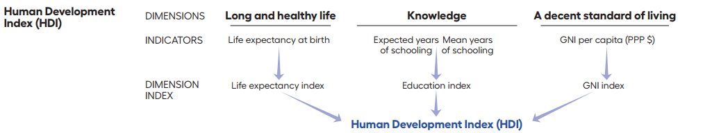{width=800px}

## Calculating the HDI
- Creating dimension indices
  - Goalposts
  
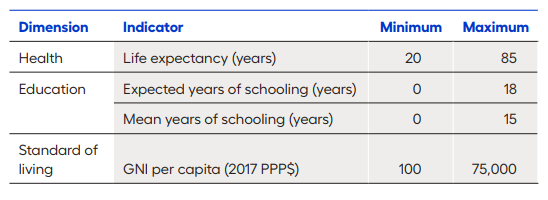

- $HDI = (I_{health}*I_{education}*I_{income})^{1/3}$

---

- Example: India HDI 2019

```{r,message=FALSE, warning=FALSE, echo=FALSE}
library(tidyverse)
dplyr::tibble(
  Indicator = c(
    "Life Expectancy at birth (years)",
    "Expected years of schooling (years)",
    "Mean years of schooling (years)",
    "GNI per capita (2017 PPP$)"),
  Value = c(
    69.7, 12.2, 6.5, 6681)
  ) %>% 
  kableExtra::kable(format = "simple")
```


$\text{Dimension Index} = \frac{\text{actual value}-\text{minimum value}}{\text{maximum value}-\text{minimum value}}$

---

- $\text{Health Index} = \frac{\text{69.7}-\text{20}}{\text{85}-\text{20}}$
- $\text{Expected years if schooling Index} = \frac{\text{12.2}-\text{0}}{\text{18}-\text{0}}$
- $\text{Mean years of schooling Index} = \frac{\text{6.5}-\text{0}}{\text{15}-\text{0}}$
- $\text{Education Index} = \frac{\text{Expected years of schooling index}+\text{Mean years of schooling index}}{2}$
- $\text{Income Index} = \frac{\text{log(6681)}-\text{log(100)}}{\text{log(75000)}-\text{log(100)}}$
- $HDI = (I_{health}*I_{education}*I_{income})^{1/3}$


## India's HDI
- For 2019, India's HDI value is 0.645

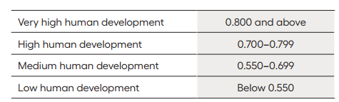

---

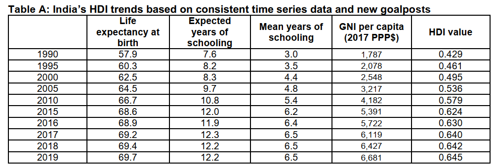{width=800px}

---

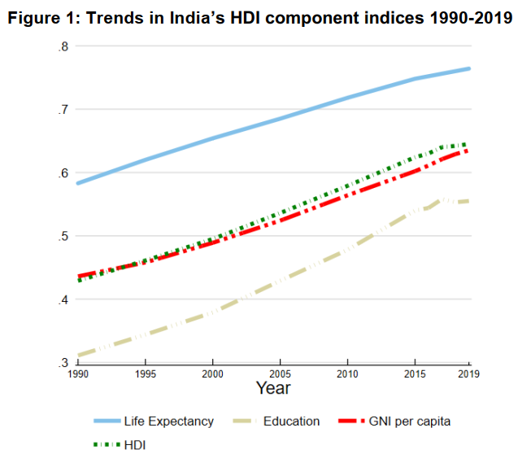

---

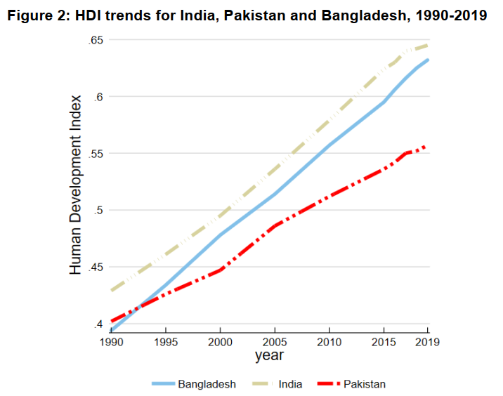

---

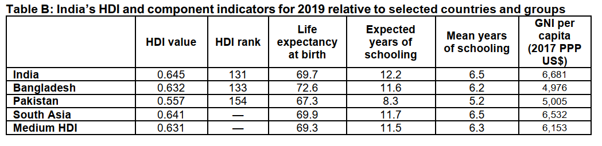{width=800px}

## Inequality Adjusted Human Development Index (IHDI)
- IHDI was introduced in the 2010 Human Development Report.
- It takes into account inequality in all three dimensions of the HDI by discounting each dimension's average value according to it's level of inequality.
- HDI - IHDI = Loss in human development due to inequality.
- As inequality in a country rises, loss in human development also rises.

---

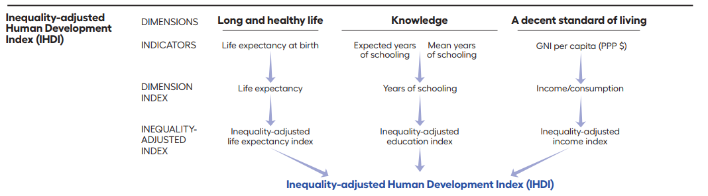{width=800px}

- Data Sources
  - HDI depends on country level aggregates
  - For IHDI additional sources of data are required
  
  
## Steps to calculate IHDI
- Step 1: Estimating inequality
  - Inequality measure $A_x = 1 - \frac{GM_x}{AM_x}$ for each variable (life expectancy, mean years of schooling, and consumption per capita) Atkinson (1970)
- Step 2: Adjusting the dimension indices for inequality
  - $I_x^* = (1-A_x).I_x$, where $A_x$ is the Atkinson measure, and $I_x$ is the HDI dimension indices.
- Step 3: Combining the dimension indices.
  - $IHDI = (I_{Health}^*. I_{Education}^*. I_{Income}^*)^{1/3}$

- Loss in HDI value due to inequality is given by
  - $Loss = 1 - [(1- A_{Health}).(1- A_{Education}).(1- A_{Income})]^{1/3}$
  
---

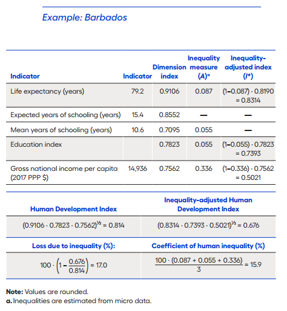


---

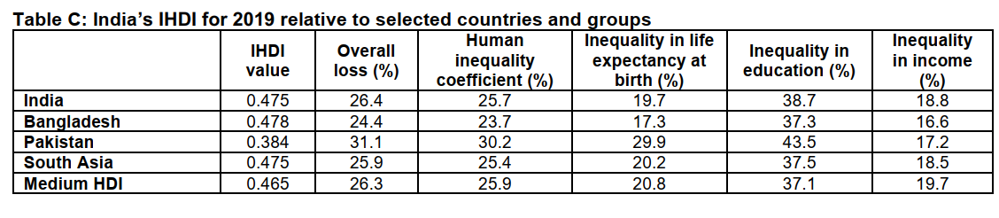{width=800px}

## Gender Development Index (GDI)
- In the 2014 Human Development Report, HDRO introduced a new measure, the GDI, based on the sexdisaggregated Human Development Index, defined as a ratio of the female to the male HDI. 
- The GDI measures gender inequalities in achievement in three basic dimensions of human development: health (measured by female and male life expectancy at birth), education (measured by female and male expected years of schooling for children and mean years for adults aged 25 years and older) and command over economic resources (measured by female and male estimated GNI per capita). 

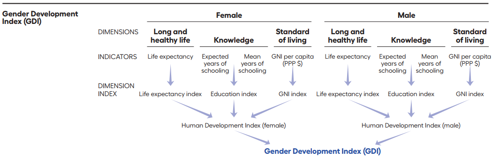{width=800px}

---

- Calculating GDI values
- Estimating male and female earned incomes
  - Female share of wage bill
$$
S_f = \frac{W_f/W_m . EA_f}{W_f/W_m . EA_f+EA_m}
$$

- $S_m = 1-S_f$ is the male share of the wage bill
- Estimated female earned income per capita $GNIpc_f$ is obtained from $GNIpc$ GNI per capita.
- $GNIpc_f = GNIpc.S_f/P_f$
- $GNIpc_m = GNIpc.S_m/P_m$

---

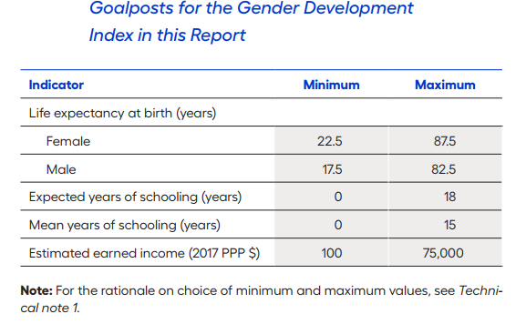
  
- The dimension indices are calculated as in the HDI using the max and the min value in the goalposts and the GNI per capita for males and females.

---

- $HDI_f = (I_{Health_f}. I_{Education_f}. I_{Income_f})^{1/3}$
- $HDI_m = (I_{Health_m}. I_{Education_m}. I_{Income_m})^{1/3}$
- $GDI = \frac{HDI_f}{HDI_m}$


---

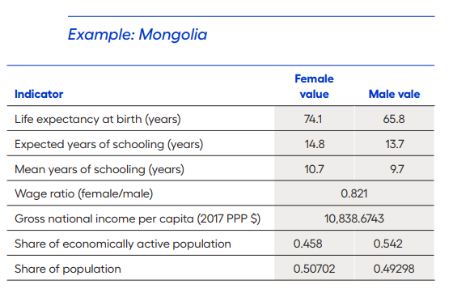

---

- Female wage bill:
$S_f = (0.821 ∙ 0.458) / [(0.821 ∙ 0.458) + 0.542] = 0.4096$
- Estimated female earned income per capita:
$GNIpc_f = 10,838.6743 ∙ 0.4096 / 0.507 = 8,756.106$
- Male wage bill:
$S_m = 1 – 0.4096 = 0.5904$
- Estimated male earned income per capita:
$GNIpc_m = 10,838.6743 ∙ 0.5904 / 0.493 = 12,980.55$
- Female health index = $(74.1 – 22.5) / (87.5 – 22.5) = 0.7938$
- Male health index = $(65.8 – 17.5) / (82.5 – 17.5) = 0.7431$
- Female education index = $[(14.8 / 18) + (10.7 / 15)] / 2 = 0.7678$
- Male education index = $[(13.7 / 18) + (9.7 / 15)] / 2 = 0.7039$
- Estimated female earned income index:
$[log(8,756.106) – log(100)] / [log(75,000) – log(100)] = 0.6756$
- Estimated male earned income index:
$[log(12,980.55) – ln(100)] / [(log(75,000) – log(100)] = 0.7350$
- Female HDI = $(0.7938 ∙ 0.7678 ∙ 0.6756)1/3 = 0.744$
- Male HDI = $(0.7431 ∙ 0.7039 ∙ 0.7350)1/3 = 0.727$
- GDI = $0.744 / 0.727 = 1.023$

## GDI groups
- The GDI groups are based on the absolute deviation of GDI from gender parity, $100.|GDI – 1|$. 
- Countries with absolute deviation from gender parity of 2.5 percent or less are considered countries with high equality in HDI achievements between women and men and are classified as **group 1**. 
- Countries with absolute deviation from gender parity of 2.5–5 percent are considered countries with medium-high equality in HDI achievements between women and men and are classified as **group 2**. 
- Countries with absolute deviation from gender parity of 5–7.5 percent are considered countries with medium equality in HDI achievements between women and men and are classified as **group 3**. 
- Countries with absolute deviation from gender parity of 7.5–10 percent are considered countries with medium-low equality in HDI achievements between women and men and are classified as **group 4**. 
- Countries with absolute deviation from gender parity of more than 10 percent are considered countries with low equality in HDI achievements between women and men and are classified as **group 5**.