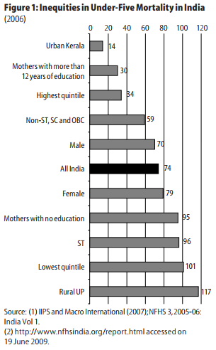
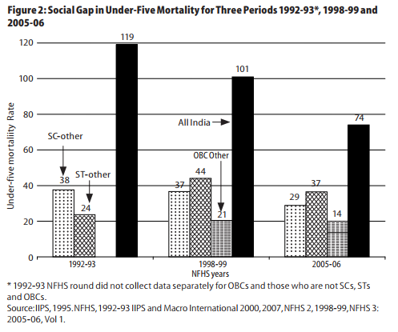
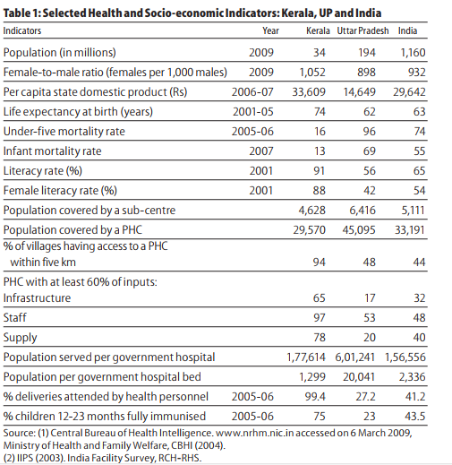
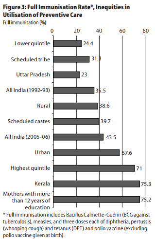
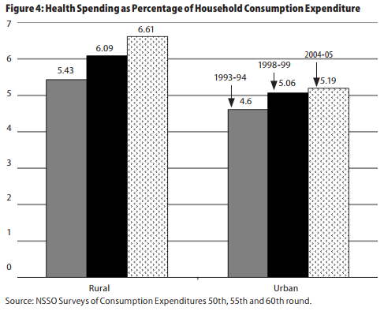
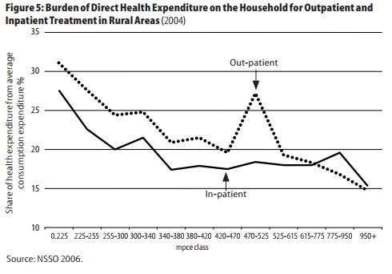
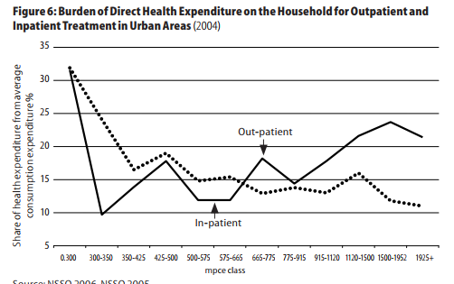

## Reference
- [Inequities in Access to Health Services in India](7.Health/baru.pdf), Baru et al. (2008) Economic and Political Weekly

## Highlights
- Progress in advancing the health status extremely slow and uneven.
- Large inequalities in health and access to health services.
- Three forms of inequities
  1. Historical inequities
  2. Socio-economic inequities
  3. Inequities in the availability, utilisation, and affordability of health services.
  
## Introduction
- Accelerated economic growth but poor achievements in health
- Caste as an important determinant of socio-economic inequities in nearly all spheres of wellbeing
- SC's comprise roughly 16% of population and 8% of them are ST's
  - Mostly living in rural areas
  - Mostly comprise of landless agricultural labourers.
  - Suffer economic and social deprivation.
- Under Five Mortality Rate (U5MR)
  - Mortality among children younger than 5 years.
  - [NFHS](http://rchiips.org/nfhs/) (2005-06) reveals sharp regional and socio-economic divides.
  - Lower castes bear the burden of mortality disproportionately.

---

<div style="float: left; width: 45%;">
- High rates of U5MR associated with income and female population.
- U5MR of the richest income quintile earners is three times lower than the poorest quintile.
  
</div>

<div style="float: right; width: 45%;">

</div>


---

- Annual rate of reduction in U5MR
  - Between 1998-99 to 2005-06
    - Among ST's : 3.9%
    - Among SC's : 4.2%
    - Rest : 4.6%
    


---

- Infant Mortality Rate (IMR)
  - Number of deaths per 1000 live births of children under 1 year of age
```{r, echo=FALSE, message=FALSE, warning=FALSE}
kableExtra::kable_styling(
kableExtra::kable(
dplyr::tibble(Year = c(1976, 1996, 2006),
           `Average Annual Rate\nof Reduction in IMR (%)` = c(2.91, 2.84, 2.31)), align = "c"), bootstrap_options = c("striped"), position = "center")
```

## Determinants of Health Inequities
- 3 forms of inequities
  1. Historical Inequities
  2. Socio-economic inequities
  3. Inequities in provision and access to health services
- Determinants for improving population health
  - Availability, accessibility, and affordability of healthcare facilities
  - Healthcare financing and provisioning arrangements

## Features of Health Service Provisioning
 - The policies and practices of the British rule
 - Inequities in availability and accessibility
 - Features during the post independence period
  - Under financed
  - Biased towards allopathic medicine, urban areas and curative services
  - Marginal role played by the indigenous systems like ayurveda, siddha, unani, and homeopathy.
  
---

- Primary level healthcare institutions
  - Sub-centres, PHC's
- Secondary level
  - Community health centres and hospitals
- Tertiary level
  - Teaching hospitals
- Inadequate expansion of facilities
- Inadequate universal coverage and access to quality care.
- Rural-urban and interstate variation in distribution of public facilities and human resources
  - Insufficient public investment
  - Failure to focus on the role and the synergies between Centre-State financing, provisioning, and administration of health services

---

- Public Insurance Schemes for employees
  - Employees' State Insurance Schemes
  - Central Government Health Scheme
  - Railways, and Posts and Telegraph Services
- Public and private insurance schemes barely cover 11% of the population (Approach Paper to the Eleventh Plan, GOI, 2006)
- The Private Sector
  - 'For profit' institutions
  - 'Not for profit' institutions
    - Community level programmes, dispensaries, and hospitals largely funded by religious and secular organisations.
    
## Inequities in access to health services

{position="center"}

---

**Inequities in the utilisation of Preventive Services**


<div style="float: left; width: 45%;">
- Preventive services: Childhood immunisation and Antenatal Care (ANC)
- Immunisation coverage differentials across states
- Immunisation coverage differential across socio-economic groups 
</div>

<div style="float: right; width: 45%;">

</div>

## Inequities in utilisation of Curative Services
- 80% dependence on the private sector for outpatient care
- Utilisation of public sector OPD
  - 2004: rural - 21%, urban - 19%
- Inpatient treatment
  - 1980s - around 60%
  - 2004 - 42% rural, 38% urban
- Mainly due to absence of strong public sector

## Affordability of health services
- Affordability is determined by
  - Cost of treatment
  - Household's ability to manage those costs
  - Its impact on the livelihood of the households
- In India, 80% of the total health expenditure and 97% of the private expenditure are borne through OOP payments
  - Large component of OOP expenditure is the medicine purchase.
  - NSSO (1999-2000): 70% of OOP expenditure in urban and 77% in rural spent on medicines.
- Socio-economic differential
  - Poorest rural quintile spends 87% of OOP expenditure on medicine and 65% by the richest urban quintile.
  
## Inequities in health expenditure burden
<div style="float: left; width: 30%;">
- Expenditure on consumption of healthcare is higher in the rural than in the urabn population.
- NSSO 2004-05 Consumption Survey
  - 6.6% of the HHs consumption was in health in the rural and 5.2% inthe urban.
  - In 1993, this was 5.5% in rural and 4.6% in urban

</div>

<div style="float: right; width: 65%;">
{width=400px}
</div>


---



---



