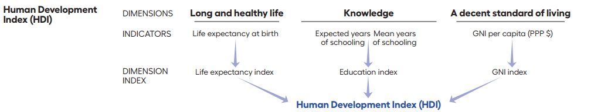
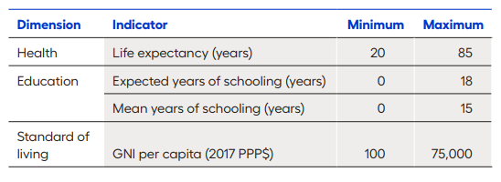

## Reference
- [Human Development Report 2020](8.HDI/hdi.pdf)

## Introduction
- 2020 is the year that marks the 30th Anniversary of the first Human Development Report.
- The Human Development Index (HDI) assesses a  population's average **longevity, education, and income**.
- Over the years more interest grown in assessing other critical dimensions of human development.
- New measures that complement the HDI
  - Missing dimensions of development in HDI
    - Poverty, inequality, and gender gaps.

---

- Since 2010, Human Development Report Office has been publishing the following
  - Inequality Adjusted Human Development Index (IHDI)
  - Multidimenstional Poverty Index (MPI)
  - HDI on gender since 1995
    - Gender Development Index (GDI)
    - Gender Inequality Index (GII)
    
## The Human Develpoment Index (HDI)
- HDI is a summary measure for assessing long-term progress in the three basic dimensions of human development
  - A long and healthy life (*life expectancy*)
  - Access to knowledge (*mean years of schooling and expected years of schooling*)
  - Decent standard of living (*Gross National Income per capita PPP$*)

{width=800px}

## Calculating the HDI
- Creating dimension indices
  - Goalposts
  


- $HDI = (I_{health}*I_{education}*I_{income})^{1/3}$

---

- Example: India HDI 2019

```{r,message=FALSE, warning=FALSE, echo=FALSE}
library(tidyverse)
dplyr::tibble(
  Indicator = c(
    "Life Expectancy at birth (years)",
    "Expected years of schooling (years)",
    "Mean years of schooling (years)",
    "GNI per capita (2017 PPP$)"),
  Value = c(
    69.7, 12.2, 6.5, 6681)
  ) %>% 
  kableExtra::kable(format = "simple")
```


$\text{Dimension Index} = \frac{\text{actual value}-\text{minimum value}}{\text{maximum value}-\text{minimum value}}$

---

- $\text{Health Index} = \frac{\text{69.7}-\text{20}}{\text{85}-\text{20}}$
- $\text{Expected years if schooling Index} = \frac{\text{12.2}-\text{0}}{\text{18}-\text{0}}$
- $\text{Mean years of schooling Index} = \frac{\text{6.5}-\text{0}}{\text{15}-\text{0}}$
- $\text{Education Index} = \frac{\text{Expected years of schooling index}-\text{Mean years of schooling index}}{2}$
- $\text{Income Index} = \frac{\text{log(6681)}-\text{log(100)}}{\text{log(75000)}-\text{log(100)}}$
- $HDI = (I_{health}*I_{education}*I_{income})^{1/3}$
